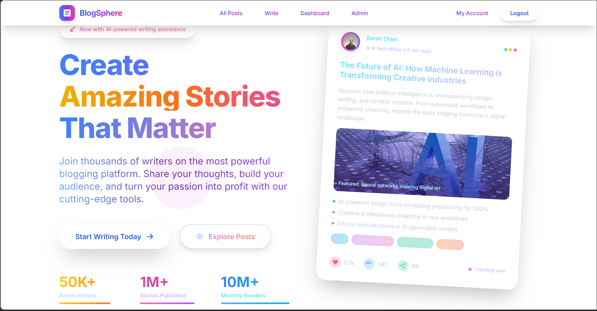
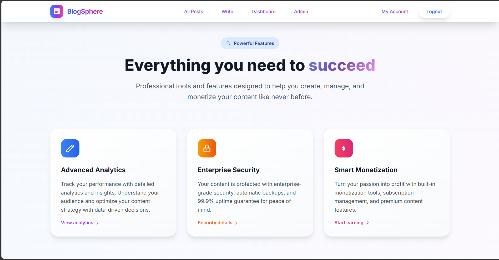
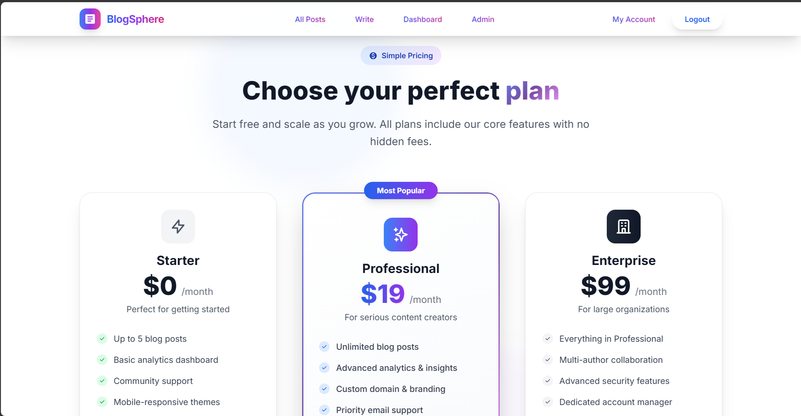
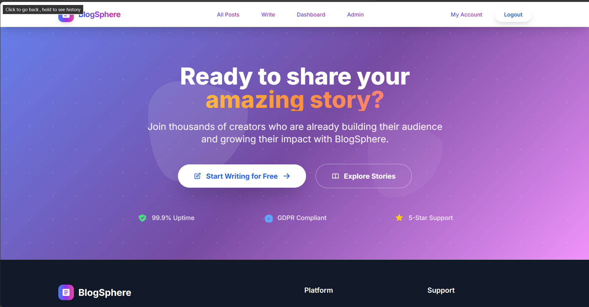
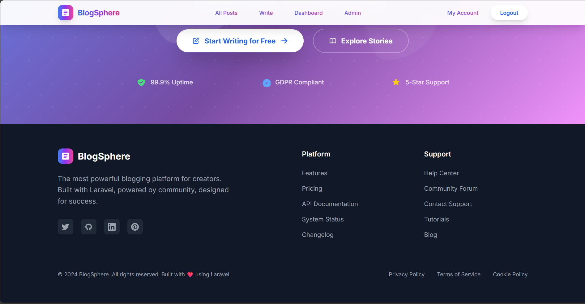

<p align="center"><a href="https://laravel.com" target="_blank"></a></p>

<p align="center">
<a href="https://github.com/laravel/framework/actions"></a>
<a href="https://packagist.org/packages/laravel/framework"></a>
<a href="https://packagist.org/packages/laravel/framework"></a>
<a href="https://packagist.org/packages/laravel/framework"></a>
</p>

# BlogSphere - Multi-User Blogging Platform

A fully functional multi-user blogging platform built with Laravel 12, featuring role-based access control, OAuth authentication, modern UI with Tailwind CSS, and AWS S3 integration for media storage. Live demo: [https://multi-user-blogging-platform-production.up.railway.app](https://multi-user-blogging-platform-production.up.railway.app)

## 🚀 Live Demo & Screenshots

### Hero Section & Landing Page


The modern, responsive landing page features:
- **Gradient backgrounds** with animated floating elements
- **Dynamic navbar** that changes color on scroll for optimal visibility
- **OAuth integration** with Google & GitHub login buttons
- **Call-to-action sections** with smooth animations
- **Statistics counters** showing platform engagement (50K+ writers, 1M+ stories, 10M+ readers)

### Features Showcase


Our feature-rich platform offers:
- **Rich Text Editor** with TinyMCE integration for professional content creation
- **Smart Analytics** to track post performance and audience engagement
- **Enterprise Security** with role-based access control and secure authentication
- **Monetization Tools** for content creators to earn from their work
- **Ultimate Customization** with themes, custom domains, and branding options
- **Community Features** for user interaction and content discovery

### Pricing Plans


Flexible pricing tiers designed for different user needs:
- **Starter Plan ($0/month)**: Perfect for beginners with basic features
- **Professional Plan ($19/month)**: Advanced analytics and unlimited posts
- **Enterprise Plan ($99/month)**: Full feature access with premium support

### Call-to-Action & Footer



Professional design elements including:
- **Compelling CTAs** encouraging user engagement
- **Social media integration** with GitHub, LinkedIn, and other platforms
- **Comprehensive footer** with platform links, support resources, and legal information
- **Trust indicators** showing 99.9% uptime and GDPR compliance

## 📝 Content Management

### Blog Post Management


The blog interface features:
- **Grid layout** displaying posts with featured images from AWS S3
- **Category indicators** with color-coded tags
- **Author information** and publication dates
- **Responsive design** that works on all device sizes
- **Pagination** for easy navigation through content

### Individual Post View


Rich post viewing experience includes:
- **Featured image display** with optimized loading from S3
- **Like, Comment, and Save functionality** for user engagement
- **Author profiles** with avatar support
- **Tag system** for content categorization
- **Social sharing** capabilities
- **Nested comments** with moderation system

## 👨‍💼 Admin Dashboard

### Administrative Overview


Comprehensive admin panel featuring:
- **Real-time statistics** showing total users, posts, and engagement metrics
- **Quick action buttons** for common administrative tasks
- **Recent activity feeds** for posts and user registrations
- **Analytics charts** for platform performance monitoring
- **User role management** with permission-based access control

### Content Management System


Advanced content management tools:
- **Bulk operations** for post management
- **Content moderation** with approval workflows
- **User management** with role assignments
- **Category and tag administration**
- **Comment moderation** system
- **Media library** management with S3 integration

## 🔐 Authentication & Authorization

### OAuth Integration
- **Google OAuth** for seamless social login
- **GitHub OAuth** for developer-friendly authentication
- **Traditional registration** with email verification
- **Password reset** functionality

### Role-Based Access Control
- **Admin Role**: Full platform access, user management, content moderation
- **Editor Role**: Content creation and management, comment moderation
- **Reader Role**: Content consumption, commenting, liking, and saving posts

## 📝 Blog Management Features

### Rich Content Creation
- **TinyMCE Editor**: Professional WYSIWYG editor with advanced formatting
- **Image Upload**: Automatic resizing and optimization with AWS S3 storage
- **Categories & Tags**: Comprehensive content organization system
- **Post States**: Draft, Published, and Archived status management
- **SEO Optimization**: Slug-based URLs and meta tag management

### Content Organization
- **Featured Images**: S3-hosted images with automatic optimization
- **Category System**: Color-coded categories for visual organization
- **Tag Management**: Flexible tagging system for content discovery
- **Search Functionality**: Advanced search across posts and authors

## 💬 Engagement Features

### Community Interaction
- **Nested Comments**: Threaded discussions with moderation
- **Like System**: User engagement tracking
- **Save Functionality**: Bookmark posts for later reading
- **View Tracking**: Post analytics and popularity metrics
- **Author Following**: Build communities around content creators

### Content Discovery
- **Related Posts**: AI-powered content recommendations
- **Trending Content**: Popular posts based on engagement
- **Category Browsing**: Organized content exploration
- **Tag-based Discovery**: Find content by topics of interest

## 🛠 Tech Stack

### Backend Technologies
- **Laravel 12**: Modern PHP framework with latest features
- **MySQL**: Robust relational database management
- **AWS S3**: Cloud storage for media files and images
- **Railway**: Cloud deployment platform
- **Spatie Permissions**: Advanced role and permission management

### Frontend Technologies
- **Blade Templates**: Laravel's templating engine
- **Tailwind CSS**: Utility-first CSS framework
- **Alpine.js**: Lightweight JavaScript framework
- **TinyMCE**: Professional rich text editor

### DevOps & Infrastructure
- **Railway Deployment**: Automatic deployments with environment management
- **AWS S3 Integration**: Scalable media storage and delivery
- **HTTPS Enforcement**: Secure connections in production
- **Environment Configuration**: Separate staging and production environments

## 🚀 Installation & Setup

### Prerequisites
- PHP 8.2 or higher
- Composer 2.x
- Node.js 18+ with npm
- MySQL 8.0+
- AWS S3 bucket (for production)

### Local Development Setup

1. **Clone the repository**
```bash
git clone https://github.com/yourusername/blog-platform.git
cd blog-platform
```

2. **Install dependencies**
```bash
composer install
npm install
```

3. **Environment configuration**
```bash
cp .env.example .env
php artisan key:generate
```

4. **Database setup**
```bash
# Update .env with your database credentials
DB_CONNECTION=mysql
DB_HOST=127.0.0.1
DB_PORT=3306
DB_DATABASE=blogsphere
DB_USERNAME=your_username
DB_PASSWORD=your_password

# Run migrations and seeders
php artisan migrate
php artisan db:seed --class=RolePermissionSeeder
php artisan db:seed --class=BlogSeeder
```

5. **OAuth Configuration**
```bash
# Google OAuth Setup
GOOGLE_CLIENT_ID=your_google_client_id
GOOGLE_CLIENT_SECRET=your_google_client_secret

# GitHub OAuth Setup
GITHUB_CLIENT_ID=your_github_client_id
GITHUB_CLIENT_SECRET=your_github_client_secret
```

6. **AWS S3 Configuration (Production)**
```bash
FILESYSTEM_DISK=s3
AWS_ACCESS_KEY_ID=your_access_key
AWS_SECRET_ACCESS_KEY=your_secret_key
AWS_DEFAULT_REGION=your_region
AWS_BUCKET=your_bucket_name
AWS_URL=https://your_bucket.s3.region.amazonaws.com
```

7. **Build assets and start development server**
```bash
npm run dev
php artisan serve
```

### Production Deployment

The application is deployed on Railway with the following configuration:

```bash
# Production environment variables
APP_ENV=production
APP_DEBUG=false
APP_URL=https://multi-user-blogging-platform-production.up.railway.app

# Database (Railway MySQL)
DB_CONNECTION=mysql
DB_HOST=tramway.proxy.rlwy.net
DB_PORT=59092
DB_DATABASE=railway

# S3 Storage
FILESYSTEM_DISK=s3
AWS_BUCKET=thisaradasun
AWS_DEFAULT_REGION=eu-north-1
```

## 👥 User Guide

### Getting Started
1. **Visit the platform**: Navigate to the live demo URL
2. **Create an account**: Use email registration or OAuth (Google/GitHub)
3. **Explore content**: Browse posts, categories, and tags
4. **Engage**: Like, comment, and save interesting posts

### For Content Creators
1. **Request editor access**: Contact admin for content creation permissions
2. **Create posts**: Use the rich text editor to write engaging content
3. **Add media**: Upload featured images that are automatically optimized
4. **Organize content**: Use categories and tags for better discoverability
5. **Monitor performance**: Track views, likes, and comments on your posts

### For Administrators
1. **Access admin dashboard**: Available at `/admin/dashboard`
2. **Manage users**: Assign roles and permissions
3. **Moderate content**: Review and approve posts and comments
4. **Monitor analytics**: Track platform usage and engagement
5. **Configure settings**: Manage categories, tags, and system settings

## 🔧 API Endpoints

### Authentication
- `GET /auth/google` - Google OAuth redirect
- `GET /auth/github` - GitHub OAuth redirect
- `POST /login` - Standard login
- `POST /register` - User registration
- `POST /logout` - User logout

### Blog Management
- `GET /blog` - List all published posts
- `GET /blog/{slug}` - View single post
- `POST /posts` - Create new post (auth required)
- `PUT /posts/{post}` - Update post (auth required)
- `DELETE /posts/{post}` - Delete post (auth required)

### User Interactions
- `POST /posts/{post}/like` - Toggle like status
- `POST /posts/{post}/save` - Toggle save status
- `POST /posts/{post}/comments` - Add comment

### Admin Endpoints
- `GET /admin/dashboard` - Admin dashboard
- `GET /admin/users` - User management
- `GET /admin/comments` - Comment moderation
- `PATCH /admin/comments/{comment}/approve` - Approve comment
- `PATCH /admin/comments/{comment}/reject` - Reject comment

## 🗂 Project Structure

```
blog-platform/
├── app/
│   ├── Http/Controllers/
│   │   ├── Auth/SocialiteController.php
│   │   ├── PostController.php
│   │   ├── CommentController.php
│   │   └── CategoryController.php
│   ├── Models/
│   │   ├── User.php
│   │   ├── Post.php
│   │   ├── Comment.php
│   │   └── Category.php
│   ├── Policies/
│   │   └── PostPolicy.php
│   └── Middleware/
│       ├── CheckRole.php
│       └── CheckPermission.php
├── database/
│   ├── migrations/
│   └── seeders/
├── resources/
│   ├── views/
│   │   ├── blog/
│   │   ├── posts/
│   │   ├── admin/
│   │   └── auth/
│   ├── css/app.css
│   └── js/
│       ├── app.js
│       ├── navbar.js
│       └── animations.js
├── routes/
│   ├── web.php
│   └── auth.php
└── Resources/ (Screenshots)
    ├── hero.png
    ├── features.png
    ├── pricing.png
    ├── CTA.png
    ├── footer.png
    ├── Posted Blogs.png
    ├── Post Full View Like Comment Save.png
    ├── admin stat dasshbaord.png
    └── admin post mange.png
```

## 🚀 Performance & Security

### Performance Optimizations
- **Image optimization**: Automatic resizing and compression
- **CDN integration**: AWS S3 for fast global content delivery
- **Database indexing**: Optimized queries for better performance
- **Caching**: Redis integration for session and cache management
- **Lazy loading**: Images and content loaded on demand

### Security Features
- **CSRF Protection**: All forms protected against cross-site request forgery
- **SQL Injection Prevention**: Eloquent ORM with parameterized queries
- **XSS Protection**: Input sanitization and output escaping
- **HTTPS Enforcement**: SSL/TLS encryption for all communications
- **Role-based Access**: Granular permission system with Spatie

## 🔮 Future Enhancements

### Planned Features
- **Mobile Application**: React Native app for iOS and Android
- **Advanced Analytics**: Detailed insights for content creators
- **Email Notifications**: Automated updates for user engagement
- **Multi-language Support**: Internationalization for global users
- **AI Content Suggestions**: Machine learning-powered content recommendations
- **Advanced Search**: Elasticsearch integration for better search capabilities

### Technical Improvements
- **API Development**: RESTful API for third-party integrations
- **Microservices Architecture**: Scalable service-oriented design
- **Real-time Features**: WebSocket integration for live notifications
- **Enhanced Caching**: Redis clusters for improved performance
- **Monitoring & Logging**: Advanced application monitoring with tools like New Relic

## 🤝 Contributing

We welcome contributions to BlogSphere! Please follow these steps:

1. **Fork the repository**
2. **Create a feature branch**: `git checkout -b feature/amazing-feature`
3. **Make your changes** and write tests if applicable
4. **Commit your changes**: `git commit -m 'Add amazing feature'`
5. **Push to the branch**: `git push origin feature/amazing-feature`
6. **Open a Pull Request** with a detailed description

### Development Guidelines
- Follow PSR-12 coding standards for PHP
- Use semantic versioning for releases
- Write comprehensive tests for new features
- Update documentation for any API changes
- Ensure all tests pass before submitting PRs

## 📄 License

This project is licensed under the [MIT License](https://opensource.org/licenses/MIT). See the LICENSE file for details.

## 🆘 Support & Documentation

### Getting Help
- **Issues**: Report bugs or request features on GitHub Issues
- **Discussions**: Join community discussions on GitHub Discussions
- **Email**: Contact us at support@blogsphere.com
- **Documentation**: Comprehensive docs available at `/docs`

### Community
- **Discord**: Join our developer community
- **Twitter**: Follow @BlogSphere for updates
- **LinkedIn**: Connect with our team for professional updates

---

## 🏆 Acknowledgments

- **Laravel Team**: For the amazing framework
- **Tailwind CSS**: For the utility-first CSS framework
- **Railway**: For seamless deployment experience
- **AWS**: For reliable cloud infrastructure
- **TinyMCE**: For the professional rich text editor
- **Spatie**: For the excellent Laravel packages

---

<p align="center">
  <strong>Built with ❤️ using Laravel, Tailwind CSS, and modern web technologies</strong>
</p>

<p align="center">
  <a href="https://multi-user-blogging-platform-production.up.railway.app">🚀 View Live Demo</a> •
  <a href="#installation--setup">📖 Setup Guide</a> •
  <a href="#-api-endpoints">🔗 API Docs</a> •
  <a href="#-contributing">🤝 Contribute</a>
</p>
